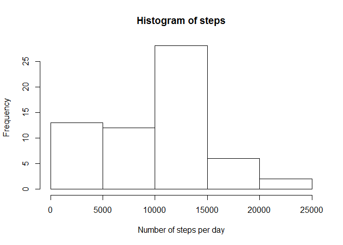
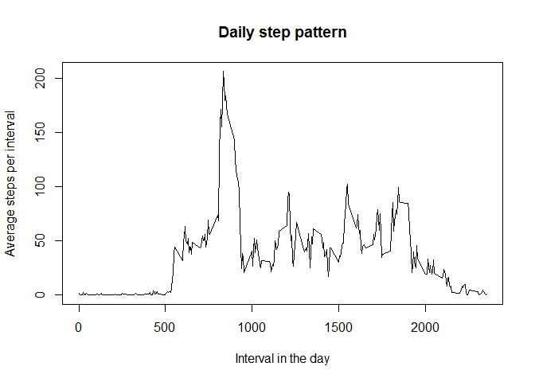
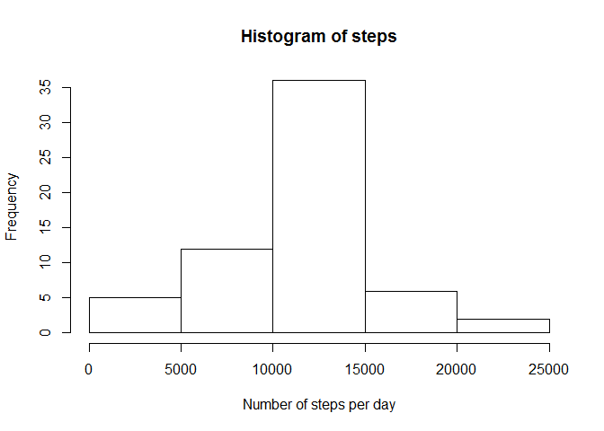
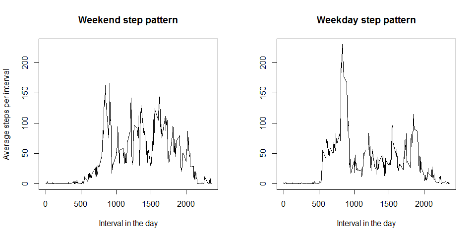

# Reproducible Research: Peer Assessment 1

<br>

## Loading and preprocessing the data

First you need to locate the data, unzip it and read it into R.

```r
setwd("~\\GitHub\\RepData_PeerAssessment1")
unzip("activity.zip")
a = read.csv("activity.csv", stringsAsFactors = FALSE)
```
The date column needs to be formatted so that it can be used as a date.

```r
a$date=as.Date(a$date, format = "%Y-%m-%d")
```
We check that the data is read in and formatted properly.

```r
summary(a)
```

```
##      steps             date               interval     
##  Min.   :  0.00   Min.   :2012-10-01   Min.   :   0.0  
##  1st Qu.:  0.00   1st Qu.:2012-10-16   1st Qu.: 588.8  
##  Median :  0.00   Median :2012-10-31   Median :1177.5  
##  Mean   : 37.38   Mean   :2012-10-31   Mean   :1177.5  
##  3rd Qu.: 12.00   3rd Qu.:2012-11-15   3rd Qu.:1766.2  
##  Max.   :806.00   Max.   :2012-11-30   Max.   :2355.0  
##  NA's   :2304
```
The unzipped data file can now be removed, to save space and keep the working directory tidy.

```r
file.remove("activity.csv")
```

```
## [1] TRUE
```

<br>

## What is mean total number of steps taken per day?

The number of steps per interval must be added up to get the number of steps per day. Then we can plot a histogram.

```r
b = sapply(split(a$steps,a$date),sum, na.rm = TRUE)
hist(b, main = "Histogram of steps", xlab = "Number of steps per day")
```

 

Since b already has the missing vaules removed, we can find the mean and the median without calling extra options.

```r
mean(b)
```

```
## [1] 9354.23
```

```r
median(b)
```

```
## [1] 10395
```

<br>


## What is the average daily activity pattern?

We find the mean value of each interval accross all days and plot it in on a line graph.

```r
cc = sapply(split(a$steps,a$interval),mean, na.rm = TRUE)
plot(names(cc), cc, type = "l", xlab = "Interval in the day", ylab = "Average steps per interval", main = "Daily step pattern")
```

 

To find the interval with most steps, on average, we sort the vector of averages, and take the first value. The name of the resulting vector is the interval we are looking for.

```r
names(sort(cc, decreasing = TRUE)[1])
```

```
## [1] "835"
```

<br>

## Imputing missing values

First we check how many missing values there are.


```r
sum(!complete.cases(a))
```

```
## [1] 2304
```

For missing values, we take the average for that particular interval over all days. We must check afterwards that this did remove all missing values.


```r
d = a
for (i in 1:nrow(d))
{
  if (is.na(d[i,1]))
	{
		dd = subset(a,a$interval == d$interval[i])
		d[i,1]=mean(dd$steps, na.rm = TRUE)
	}
}
summary(d)
```

```
##      steps             date               interval     
##  Min.   :  0.00   Min.   :2012-10-01   Min.   :   0.0  
##  1st Qu.:  0.00   1st Qu.:2012-10-16   1st Qu.: 588.8  
##  Median :  0.00   Median :2012-10-31   Median :1177.5  
##  Mean   : 37.38   Mean   :2012-10-31   Mean   :1177.5  
##  3rd Qu.: 27.00   3rd Qu.:2012-11-15   3rd Qu.:1766.2  
##  Max.   :806.00   Max.   :2012-11-30   Max.   :2355.0
```

Now we can redo the histogram from before.


```r
b = sapply(split(d$steps,d$date),sum)
hist(b, main = "Histogram of steps", xlab = "Number of steps per day")
```

 

The median value is an imputed value, and it is now the same as the mean.The mean and median are both higher then before, because the distribution of steps is less skew.


```r
mean(b)
```

```
## [1] 10766.19
```

```r
median(b)
```

```
## [1] 10766.19
```

<br>

## Are there differences in activity patterns between weekdays and weekends?

First we must create a factor variable to indicate whether the measurement was taken on a weekday or on the weekend.


```r
d$weekday = !(weekdays(d$date)=="Saturday" | weekdays(d$date)=="Sunday")
d$weekday = factor(d$weekday, labels = c("weekend", "weekday"))
str(d)
```

```
## 'data.frame':	17568 obs. of  4 variables:
##  $ steps   : num  1.717 0.3396 0.1321 0.1509 0.0755 ...
##  $ date    : Date, format: "2012-10-01" "2012-10-01" ...
##  $ interval: int  0 5 10 15 20 25 30 35 40 45 ...
##  $ weekday : Factor w/ 2 levels "weekend","weekday": 2 2 2 2 2 2 2 2 2 2 ...
```

To plot the two graphs, we first split the data into two data sets, and then sum the number of steps per day in each set.


```r
e = split(d,d$weekday)
c1 = sapply(split(e$weekend$steps,e$weekend$interval),mean)
c2 = sapply(split(e$weekday$steps,e$weekday$interval),mean)
```

To plot the two line graphs, we need to set the mfcol parameter first.


```r
par(mfcol = 1:2)
plot(names(c1), c1, type = "l", xlab = "Interval in the day", ylab = "Average steps per interval", ylim = c(0,max(c2)), main = "Weekend step pattern")
plot(names(c2), c2, type = "l", xlab = "Interval in the day", ylab = "", main = "Weekday step pattern")
```

 

This person seems walk much more on the weekend then during the week, although there are periods of more intense activity suring the week.
